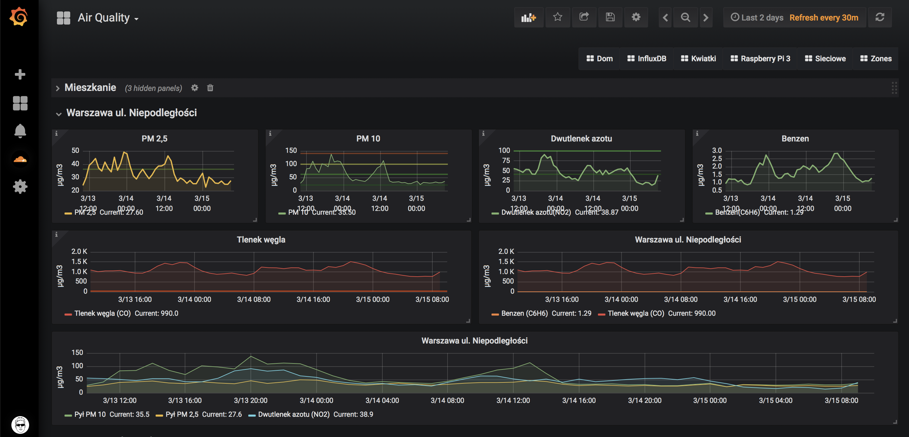

- [Instalacja Grafany](#instalacja-grafany)
    - [Dodanie kluczy publicznych repozytorium](#dodanie-kluczy-publicznych-repozytorium)
    - [Instalacja repozytorium](#instalacja-repozytorium)
    - [Aktualizowanie pluginów w grafanie](#aktualizowanie-plugin%C3%B3w-w-grafanie)

# Instalacja Grafany



## Dodanie kluczy publicznych repozytorium

```bash
sudo apt-get install apt-transport-https curl
curl https://bintray.com/user/downloadSubjectPublicKey?username=bintray | sudo apt-key add -
```

## Instalacja repozytorium

```bash
echo "deb https://dl.bintray.com/fg2it/deb stretch main" | sudo tee -a /etc/apt/sources.list.d/grafana.list
```

zmieniamy stretch na jessie jeśli działamy na starszej wersji systemu
zmieniamy main na testing jeśli interesują nas wersje beta

`sudo apt-get update`
`sudo apt-get install grafana`

Możemy też sprawdzić sobie dostępne wersje sudo apt-cache madison grafana

## Aktualizowanie pluginów w grafanie

```bash
sudo su -s /bin/bash grafana
grafana-cli plugins update-all
```

[Źródło:] <https://github.com/fg2it/grafana-on-raspberry/wiki#with-apt-from-bintray-debian-repository>
