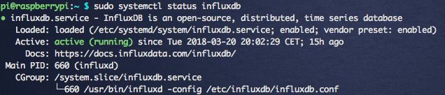

- [Instalacja InfluxDB](#instalacja-influxdb)

# Instalacja InfluxDB



Dla poprawienia: Tym razem możemy dodać źródło pakietów:

```bash
echo "deb https://repos.influxdata.com/debian stretch stable" | sudo tee -a /etc/apt/sources.list.d/influxdb.list
```

Do tego trzeba jeszcze doinstalować: sudo apt-get install apt-transport-https -y (pakiet pozwala na https w sources.list)
następnie trzeba dodać klucz GPG bo przy próbie update wywali jego brak:
Wykonanie komendy: `sudo apt-get update` powinno dać podobny wynik:

```bash
[...]
Get:13 https://repos.influxdata.com jessie/stable Translation-en [334 B]
Get:14 https://repos.influxdata.com jessie/stable Translation-en_GB [337 B]
Ign https://repos.influxdata.com jessie/stable Translation-en_GB
Get:15 https://repos.influxdata.com jessie/stable Translation-en [334 B]
Ign https://repos.influxdata.com jessie/stable Translation-en
Fetched 5,424 B in 13s (402 B/s)
Reading package lists... Done
GPG error: https://repos.influxdata.com jessie InRelease: The following signatures couldn't be verified because the public key is not available: NO_PUBKEY 684A14CF2582E0C5
```

A więc podstawiamy klucz do ponizszej komendy:

`sudo apt-key adv --keyserver ha.pool.sks-keyservers.net --recv-keys 684A14CF2582E0C5`

```bash
[...]
gpg: requesting key 2582E0C5 from hkp server ha.pool.sks-keyservers.net
gpg: key 2582E0C5: public key "InfluxDB Packaging Service <support@influxdb.com>" imported
gpg: Total number processed: 1
gpg:               imported: 1  (RSA: 1)
```

Tworzymy konto systemowe:
`$ sudo useradd -rm influxdb`

oraz instalujemy:
`sudo apt-get install telegraf influxdb`